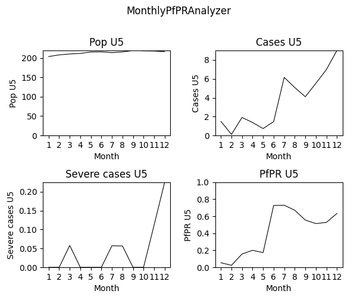
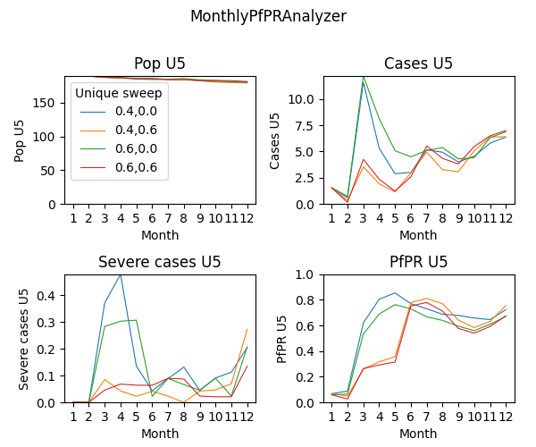

# Malaria Modeling Faculty Enrichment Program 2022

### Technical track (EMOD)

Example scripts for the [weekly lessons](https://faculty-enrich-2022.netlify.app/lessons/) of the faculty enrichment
program 2022.

#### Weekly examples

- [Go to Week 1](#week1)
- [Go to Week 2](#week2)
- [Go to Week 3](#week3)
- [Go to Week 4](#week4)
- Week 5: no technical track
- [Go to Week 6](#week6)
- [Go to Week 7](#week7)
- [Go to Week 8](#week8)
- [Go to Week 9](#week9)
- Week 10: no technical track
- [Go to Week 11](#week11)
- [Go to Week 12](#week12)
- [Go to Week 13](#week13)
- [Go to Week 14](#week14)

__Table 1: Overview of scripts used throughout the course__

|Script |Description | 
|-------|------------|
|run_exampleSim.py |the main simulation script which will be expanded and modified throughout the lessons | 
|analyze_exampleSim_w1.py |the main analyzer script which changes each week (w1, w2,...w5) | 
|generate_input_files.py |the default script for creating demographics and climate which needs to run only once or when substantial changes are made | 
|plot_exampleSim.py, plot_exampleSim.R | plotting scripts outside of analyzerin python or R | 

## Week 1: Overview of EMOD <a name="week1"></a>

[Lesson Week 1](https://faculty-enrich-2022.netlify.app/lessons/week-1/)

### Instructions

- Adjust paths in `simtools.ini` by replacing `<USERNAME>` with your username
- Run simulation via `python run_exampleSim.py`
- Wait simulation to finish (~5 minutes)
- Update expt_id in `analyze_exampleSim_w1.py`
- Run analyzer via `python analyze_exampleSim_w1.py`
- Inspect `simulation_outputs` to see generated simulation results (csv file)
- Done!

<details><summary><span>Check results</span></summary>
<p>

Terminal output after successful submission of analyzer


</p>
</details>

## Week 2: Basic building blocks of EMOD <a name="week2"></a>

[Lesson Week 2](https://faculty-enrich-2022.netlify.app/lessons/week-2/)

EMOD How To's:

- [Update config parameters](https://faculty-enrich-2022.netlify.app/modules/emod-how-to/emod-how-to/#update-config-parameters)
- [Create a demographics file](https://faculty-enrich-2022.netlify.app/modules/emod-how-to/emod-how-to/#create-a-demographics-file)
- [Create climate files](https://faculty-enrich-2022.netlify.app/modules/emod-how-to/emod-how-to/#create-climate-files)

### Instructions

- Create _demographics_ and _climate_ files via `generate_input_files.py`
- Update default parameters in `python run_exampleSim.py`:

    ```py
    cb.update_params({
        'Demographics_Filenames': [os.path.join('Ghana', 'Ghana_2.5arcmin_demographics.json')],
        "Air_Temperature_Filename": os.path.join('Ghana', 'Ghana_single_node_air_temperature_daily.bin'),
        "Land_Temperature_Filename": os.path.join('Ghana', 'Ghana_single_node_land_temperature_daily.bin'),
        "Rainfall_Filename": os.path.join('Ghana', 'Ghana_single_node_rainfall_daily.bin'),
        "Relative_Humidity_Filename": os.path.join('Ghana', 'Ghana_single_node_relative_humidity_daily.bin')
    })
    ```

- Change _exp_name_  for week 2 `f'{user}_FE_2022_example_w2'`
- Run simulation as learned in Week 1 and wait for simulation to finish (~5 minutes)
- Run analyzer script for Week 2 `analyze_exampleSim_w2.py` (don't forget to update expt_id!)
- Inspect `simulation_outputs` to see additional generated plot
    - Optional: rerun analyzer with plot for week 1 and compare.
    - _Note that EMOD is a stochastic model and any changes at low population size and few repetitions might be at
      random and not necessarily due to the parameter change!_
- Done!

<details><summary><span>Check results</span></summary>
<p>

Generated simulation files


Generated plot


</p>
</details>

## Week 3: Interventions in EMOD <a name="week3"></a>

[Lesson Week 3](https://faculty-enrich-2022.netlify.app/lessons/week-3/)

EMOD How To's:

- [Add case management](https://faculty-enrich-2022.netlify.app/modules/emod-how-to/emod-how-to/#add-case-management)
- Add ITN
- Add IRS
- [Add larvicides](https://faculty-enrich-2022.netlify.app/modules/emod-how-to/emod-how-to/#add-larvicides)
- [Add drug campaigns](https://faculty-enrich-2022.netlify.app/modules/emod-how-to/emod-how-to/#add-drug-campaigns)
- [Using the model builder to set up multi-simulation experiments](https://faculty-enrich-2022.netlify.app/modules/emod-how-to/emod-how-to/#using-the-model-builder-to-set-up-multi-simulation-experiments)

### Instructions

#### PART I - customization of the simulation, add interventions and reports

- Add interventions and create campaign files
    - add `add_health_seeking` module import and code chunk into the script (see EMOD How To's)
    - add `add_drug_campaign` module import and code chunk into the script (see EMOD How To's) or below
      ```py
      add_drug_campaign(cb, campaign_type='SMC',
                            coverage=0.8, 
                            start_days=[30],
                            repetitions=4, 
                            tsteps_btwn_repetitions=30,
                            target_group={'agemin': 0.25, 'agemax': 5},
                            receiving_drugs_event_name='Received_SMC')
      ```
- Add custom reports
    - add `MalariaSummaryReport` (see EMOD How To's) or below
      ```py
      add_summary_report(cb, start=1, interval=30,
                       age_bins=[0.25,5,100], 
                       description='Monthly_U5')
      ```
- Change _exp_name_  for week 3 `f'{user}_FE_2022_example_w3a'`
- Run simulation and wait for simulation to finish (~5 minutes)
- Run analyzer script for Week 3 (`analyze_exampleSim_w3a.py`) (don't forget to update expt_id!)
- Inspect `simulation_outputs` and compare against outputs from the previous week.
    - New output files: `U5_PfPR_ClinicalIncidence.csv` and `U5_PfPR_ClinicalIncidence.png`

<details><summary><span>Check results</span></summary>
<p>

[To do: complete result screenshots]



</p>
</details>

#### PART II - multi-simulation experiment using ModBuilder

- Further modify the simulation script to run multiple simulations using the detailed steps below
    - import modules  `from simtools.ModBuilder import ModBuilder, ModFn`
    - specify number of seeds i.e. `numseeds = 3` (the more seeds the more single simulations run and it takes longer
      until whole simulation experiment finishes)
    - modify `run_sim_args` as follows:
      ```py
      expt_name =  f'{user}_FE_2022_example_w3b'
      run_sim_args = {
          'exp_name': expt_name,
          'config_builder': cb,
          'exp_builder' : builder
      }
      ```
    - add ModBuilder
      ```py
      builder = ModBuilder.from_list([[ModFn(DTKConfigBuilder.set_param, 'Run_Number', x)
                                      ]
                                      for x in range(numseeds)
                                      ])
      ```
- modify and extend ModBuilder to allow running different parameter sweeps
    ```py
    builder = ModBuilder.from_list([[ModFn(case_management, cm_cov_U5),
                                     ModFn(smc_intervention, coverage_level=smc_cov), 
                                     ModFn(DTKConfigBuilder.set_param, 'Run_Number', x)
                                    ]
                                    for cm_cov_U5 in [0.4, 0.6] 
                                    for smc_cov in [0, 0.6] 
                                    for x in range(numseeds)
                                    ])
    ```

- In order for case management and SMC campaigns to take different coverage parameters as specified above, they need to
  be changed into a function that takes cb as input as shows below:
    - wrap `add_health_seeking` into `case_management` function:

      ```py
      def case_management(cb, cm_cov_U5,cm_cov_adults=0.5): 
          add_health_seeking(cb, start_day=0,
                         targets=[{'trigger': 'NewClinicalCase',
                                   'coverage': cm_cov_U5,
                                   'agemin': 0,
                                   'agemax': 5,
                                   'seek': 1,
                                   'rate': 0.3},
                                  {'trigger': 'NewClinicalCase',
                                   'coverage': cm_cov_adults,
                                   'agemin': 5,
                                   'agemax': 100,
                                   'seek': 1,
                                   'rate': 0.3},
                                  {'trigger': 'NewSevereCase',
                                   'coverage': 0.85,
                                   'agemin': 0,
                                   'agemax': 100,
                                   'seek': 1,
                                   'rate': 0.5}],
                         drug=['Artemether', 'Lumefantrine'])
      
          return {'cm_cov_U5': cm_cov_U5,
                  'cm_cov_adults': cm_cov_adults}
  
      ```
    - wrap `add_drug_campaign` into `smc_intervention` function:
      ```py
      def smc_intervention(cb, coverage_level , day=30, cycles=4):
        add_drug_campaign(cb, campaign_type='SMC', drug_code='SPA',
                          coverage=coverage_level,
                          start_days=[day],
                          repetitions=cycles,
                          tsteps_btwn_repetitions=30,
                          target_group={'agemin': 0.25, 'agemax': 5},
                          receiving_drugs_event_name='Received_SMC')
  
        return {'smc_coverage': coverage_level,
               'smc_seasonalstart_day': day}
  
      ```

- Now change _exp_name_  to `f'{user}_FE_2022_example_w3b'` and the simulation is ready to go!
- Run simulation and wait for simulation to finish (~10 minutes)
- Run second analyzer script for Week 3 (`analyze_exampleSim_w3b.py`) (don't forget to update expt_id!)
- Inspect `simulation_outputs` and compare against outputs from the previous week.

<details><summary><span>Check results</span></summary>
<p>

[To do: complete result screenshots]


</p>
</details>

## Week 4: Analyzers and plotters <a name="week4"></a>

[Lesson Week 4](https://faculty-enrich-2022.netlify.app/lessons/week-4/)

EMOD How To's:

- Analyzers and plotters
- [TODO]

### Instructions

-
- Change _exp_name_  for week 4 `f'{user}_FE_2022_example_w4'`
- Run simulation and wait for simulation to finish (~10 minutes)
- Run analyzer script for Week 4 (`analyze_exampleSim_w4.py`)
- Run plotting scripts:
    - Using _Python_: `plot_exampleSim.py`
    - Using _R_: `plot_exampleSim.R`
- Inspect `simulation_outputs` and compare against outputs from the previous week.
- Done!

<details><summary><span>Check results</span></summary>
<p>

[To do: add image]
<!---->

</p>
</details>

### Week 5: no technical curriculum <a name="week5"></a>

## Week 6: Serialization <a name="week6"></a>

[Lesson Week 6](https://faculty-enrich-2022.netlify.app/lessons/week-6/)

EMOD How To's:

- Serialization
- [TODO]

### Instructions

- [TODO]

<details><summary><span>Check results</span></summary>
<p>

[To do: add image]
<!---->

</p>
</details>

## Week 7: Sweeping and calibration <a name="week7"></a>

[Lesson Week 7](https://faculty-enrich-2022.netlify.app/lessons/week-7/)

EMOD How To's:

- Sweeping and calibration
- [TODO]

### Instructions

- [TODO]

<details><summary><span>Check results</span></summary>
<p>

[To do: add image]
<!---->

</p>
</details>

## Week 8: Individual properties

[Lesson Week 8](https://faculty-enrich-2022.netlify.app/lessons/week-8/)

EMOD How To's:

- Individual properties
- [TODO]

### Instructions

- [TODO]

<details><summary><span>Check results</span></summary>
<p>

[To do: add image]
<!---->

</p>
</details>

## Week 9: Infusing simulations with real data <a name="week9"></a>

[Lesson Week 9](https://faculty-enrich-2022.netlify.app/lessons/week-9/)

EMOD How To's:

- [TODO]

### Instructions

- [TODO]

<details><summary><span>Check results</span></summary>
<p>

[To do: add image]
<!---->

</p>
</details>

### Week 10: no technical curriculum <a name="week10"></a>

## Week 11: Advanced EMOD: HBHI workflow as a complex example <a name="week11"></a>

[Lesson Week 11](https://faculty-enrich-2022.netlify.app/lessons/week-11/)

EMOD How To's:

- [TODO]

### Instructions

- [TODO]

<details><summary><span>Check results</span></summary>
<p>

[To do: add image]
<!---->

</p>
</details>

## Week 12: Advanced EMOD: Spatial modeling in EMOD <a name="week12"></a>

[Lesson Week 12](https://faculty-enrich-2022.netlify.app/lessons/week-12/)

EMOD How To's:

- [TODO]

### Instructions

- [TODO]

<details><summary><span>Check results</span></summary>
<p>

[To do: add image]
<!---->

</p>
</details>

## Week 13: Advanced EMOD: gene drive and reactive interventions <a name="week13"></a>

[Lesson Week 13](https://faculty-enrich-2022.netlify.app/lessons/week-13/)

EMOD How To's:

- [TODO]

### Instructions

- [TODO]

<details><summary><span>Check results</span></summary>
<p>

[To do: add image]
<!---->

</p>
</details>

## Week 14: HPC <a name="week14"></a>

[Lesson Week 14](https://faculty-enrich-2022.netlify.app/lessons/week-14/)

EMOD How To's:

- [TODO]

### Instructions

- [TODO]

<details><summary><span>Check results</span></summary>
<p>

[To do: add image]
<!---->

</p>
</details>


</br>
</br>

### Congratulations!

#### You reached the end of the example lessons.


