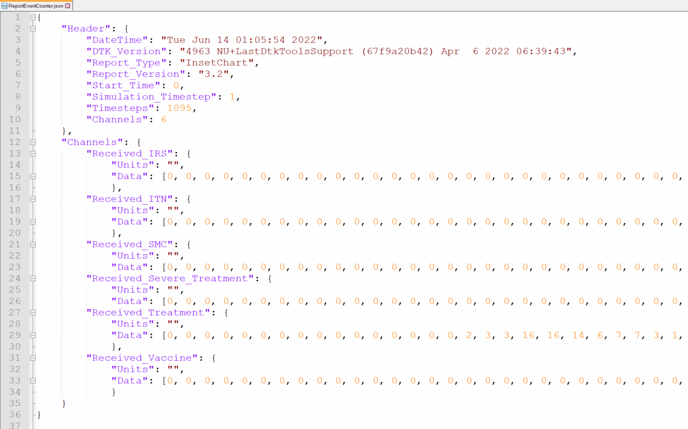

# Malaria Modeling Faculty Enrichment Program 2022

### Technical track (EMOD)

Example scripts for the [weekly lessons](https://faculty-enrich-2022.netlify.app/lessons/) of the faculty enrichment
program 2022.

#### Weekly examples

_(include temporary notes for admin)_

- [Go to Week 1](#week1)    _(MR: setup closed, open for testing)_
- [Go to Week 2](#week2)    _(MR: setup closed, open for testing)_
- [Go to Week 3](#week3)    _(MR: setup in progress (+ITN,IRS))_
- [Go to Week 4](#week4)    _(MR: setup in progress (instructions for analyzer changes))_
- Week 5: no technical track
- [Go to Week 6](#week6)    _(??: setup not started)_
- [Go to Week 7](#week7)    _(??: setup not started)_
- [Go to Week 8](#week8)    _(??: setup not started)_
- [Go to Week 9](#week9)    _(??: setup not started)_
- Week 10: no technical track
- [Go to Week 11](#week11)    _(??: setup not started)_
- [Go to Week 12](#week12)    _(??: setup not started)_
- [Go to Week 13](#week13)    _(??: setup not started)_
- [Go to Week 14](#week14)    _(??: setup not started)_

__Table 1: Overview of scripts used throughout the course__

|Script |Description | 
|-------|------------|
|run_exampleSim.py |the main simulation script which will be expanded and modified throughout the lessons | 
|analyze_exampleSim_w1.py |the main analyzer script which changes each week (w1, w2,...w5) | 
|generate_input_files.py |the default script for creating demographics and climate which needs to run only once or when substantial changes are made | 
|plot_exampleSim.py, plot_exampleSim.R | plotting scripts outside of analyzerin python or R | 
|analyzer_collection.py | collection of different analyzers used| 
|run_burnin_exampleSim.py |  <TODO: or similar when introducing serialization>  | 

## Week 1: Overview of EMOD <a name="week1"></a>

[Lesson Week 1](https://faculty-enrich-2022.netlify.app/lessons/week-1/)

### Instructions

<details><summary><span>Click to expand</span></summary>
<p>

- Adjust paths in `simtools.ini` by replacing `<USERNAME>` with your username
- Run simulation via `python run_exampleSim.py`
- Wait simulation to finish (~5 minutes)
- Update expt_id in `analyze_exampleSim_w1.py`
- Run analyzer via `python analyze_exampleSim_w1.py`
- Inspect `simulation_outputs` to see generated simulation results (csv file)
- Done!

<details><summary><span>Check results</span></summary>
<p>

Terminal output after successful submission of analyzer


</p>
</details>

</p>
</details>

## Week 2: Basic building blocks of EMOD <a name="week2"></a>

[Lesson Week 2](https://faculty-enrich-2022.netlify.app/lessons/week-2/)

EMOD How To's:

- [Update config parameters](https://faculty-enrich-2022.netlify.app/modules/emod-how-to/emod-how-to/#update-config-parameters)
- [Create a demographics file](https://faculty-enrich-2022.netlify.app/modules/emod-how-to/emod-how-to/#create-a-demographics-file)
- [Create climate files](https://faculty-enrich-2022.netlify.app/modules/emod-how-to/emod-how-to/#create-climate-files)
- [Add summary reports](https://faculty-enrich-2022.netlify.app/modules/emod-how-to/emod-how-to/#add-summary-reports)

### Instructions

<details><summary><span>Click here to expand</span></summary>
<p>

- Create _demographics_ and _climate_ files via `generate_input_files.py`
- Update default parameters in `python run_exampleSim.py`:

    ```py
    cb.update_params({
        'Demographics_Filenames': [os.path.join('Ghana', 'Ghana_2.5arcmin_demographics.json')],
        "Air_Temperature_Filename": os.path.join('Ghana', 'Ghana_30arcsec_air_temperature_daily.bin'),
        "Land_Temperature_Filename": os.path.join('Ghana', 'Ghana_30arcsec_air_temperature_daily.bin'),
        "Rainfall_Filename": os.path.join('Ghana', 'Ghana_30arcsec_rainfall_daily.bin'),
        "Relative_Humidity_Filename": os.path.join('Ghana', 'Ghana_30arcsec_relative_humidity_daily.bin'),
        "Age_Initialization_Distribution_Type": 'DISTRIBUTION_COMPLEX'
    })
    ```
- Add custom reporter with annual summary for different age groups
    - add `add_summary_report` (see EMOD How To's) or below
      ```py
      from malaria.reports.MalariaReport import add_summary_report
      add_summary_report(cb, start=1, interval=365,
                       age_bins=[0.25, 2, 5, 10, 15, 20, 100, 120], 
                       description='Annual_Agebin')
      ```
- Increase simulation duration from 1 to 3 years by modifying DTKConfigBuilder as below:
  ```py 
    years = 3
    cb = DTKConfigBuilder.from_defaults('MALARIA_SIM', Simulation_Duration=years*365)
  ```

- Change _exp_name_  for week 2 `f'{user}_FE_2022_example_w2'`
- Run simulation as learned in Week 1 and wait for simulation to finish (~5 minutes)
- Run analyzer script for Week 2 `analyze_exampleSim_w2.py` (don't forget to update expt_id!)
- Inspect `simulation_outputs` to see additional generated plot
    - Optional: rerun analyzer with plot for week 1 and compare.
    - _Note that EMOD is a stochastic model and any changes at low population size and few repetitions might be at
      random and not necessarily due to the parameter change!_
- Run additional simulations with different durations, population sizes or for different agebins _(Tip: change exp_name to keep track of your
  simulations)_ 
  ```py 
  # Example of how to change additional parameters from the config file
  cb.update_params({
        'x_Base_Population': 1,
        'x_Birth': 1,
        'x_Temporary_Larval_Habitat': 1
    })
  ```
- Again, inspect the simulation outputs and compare them against each other:  
    - How do the outcomes change?
    - What do you recognize about running time?

<details><summary><span>Check results</span></summary>
<p>

Generated simulation files


Generated plot from InsetChart


Generated plot from annual summmary report


View
suggested [solution script for week 2](https://github.com/numalariamodeling/faculty-enrich-2022-examples/blob/main/Solution_scripts/run_exampleSim_w2.py)

</p>
</details>

</p>
</details>

## Week 3: Interventions in EMOD <a name="week3"></a>

[Lesson Week 3](https://faculty-enrich-2022.netlify.app/lessons/week-3/)

EMOD How To's:

- [Add case management](https://faculty-enrich-2022.netlify.app/modules/emod-how-to/emod-how-to/#add-case-management)
- Add ITN
- Add IRS
- [Add larvicides](https://faculty-enrich-2022.netlify.app/modules/emod-how-to/emod-how-to/#add-larvicides)
- [Add drug campaigns](https://faculty-enrich-2022.netlify.app/modules/emod-how-to/emod-how-to/#add-drug-campaigns)
- Add event reporters
- [Using the model builder to set up multi-simulation experiments](https://faculty-enrich-2022.netlify.app/modules/emod-how-to/emod-how-to/#using-the-model-builder-to-set-up-multi-simulation-experiments)

### Instructions

#### PART I - customization of the simulation, add interventions and reports

<details><summary><span>Click here to expand</span></summary>
<p>

- Add multiple interventions and create campaign files (see EMOD How To's) or below. For each add code chunk into the
  exampleSim simulation script, and import the corresponding modules for the selected interventions.
    - Interventions to select:
        - <details><summary><span style="color: blue";">add_health_seeking </span></summary>
            <p>

           ```py
            from malaria.interventions.health_seeking import add_health_seeking
            add_health_seeking(cb, start_day=0,
                               targets=[{'trigger': 'NewClinicalCase', 'coverage': 0.7,
                                         'agemin': 0, 'agemax': 5, 'seek': 1, 'rate': 0.3},
                                        {'trigger': 'NewClinicalCase', 'coverage': 0.5,
                                         'agemin': 5, 'agemax': 100, 'seek': 1, 'rate': 0.3},
                                        {'trigger': 'NewSevereCase', 'coverage': 0.85,
                                         'agemin': 0, 'agemax': 100, 'seek': 1, 'rate': 0.5}],
                               drug=['Artemether', 'Lumefantrine'])
            event_list = event_list + ['Received_Treatment', 'Received_Severe_Treatment']
           ```
             </p>
             </details>
        - <details><summary><span style="color: blue";">add_drug_campaign </span></summary>
            <p>

           ```py
            from malaria.interventions.malaria_drug_campaigns import add_drug_campaign
            add_drug_campaign(cb, campaign_type='SMC', drug_code='SPA',
                              coverage=0.8,
                              start_days=[366],
                              repetitions=4,
                              tsteps_btwn_repetitions=30,
                              target_group={'agemin': 0.25, 'agemax': 5},
                              receiving_drugs_event_name='Received_SMC')
           ```
             </p>
             </details>
        - <details><summary><span style="color: blue";">add_ITN or add_ITN_age_season </span></summary>
            <p>

           ```py
            # from dtk.interventions.itn import add_ITN
            from dtk.interventions.itn_age_season import add_ITN_age_season
            # add_ITN(cb, start=0, coverage_by_ages=[{'min': 0, 'max': 100, 'coverage': 0.6}])
            add_ITN_age_season(cb, start=366,
                               demographic_coverage=0.8,
                               killing_config={
                                   "Initial_Effect": 0.520249973,  # LLIN Burkina
                                   "Decay_Time_Constant": 1460,
                                   "class": "WaningEffectExponential"},
                               blocking_config={
                                   "Initial_Effect": 0.53,
                                   "Decay_Time_Constant": 730,
                                   "class": "WaningEffectExponential"},
                               discard_times={"Expiration_Period_Distribution": "DUAL_EXPONENTIAL_DISTRIBUTION",
                                              "Expiration_Period_Proportion_1": 0.9,
                                              "Expiration_Period_Mean_1": 365 * 1.7,  # Burkina 1.7
                                              "Expiration_Period_Mean_2": 3650},
                               age_dependence={'Times': [0, 100],
                                               'Values': [0.9, 0.9]},
                               duration=-1, birth_triggered=False
                               )
           ```
            </p>
            </details>
        - <details><summary><span style="color: blue";">add_IRS </span></summary>
            <p>

           ```py
            from dtk.interventions.irs import add_IRS
            add_IRS(cb, start=366,
                    coverage_by_ages=[{"coverage": 0.8, "min": 0, "max": 100}],
                    killing_config={
                        "class": "WaningEffectBoxExponential",
                        "Box_Duration": 180,  # based on PMI data from Burkina
                        "Decay_Time_Constant": 90,  # Sumishield from Benin
                        "Initial_Effect": 0.7},
                    )
           ```
            </p>
            </details>
        - <details><summary><span style="color: blue";">add_vaccine </span></summary>
            <p>

           ```py
            from malaria.interventions.malaria_drug_campaigns import add_drug_campaign
            add_vaccine(cb,
                        vaccine_type='RTSS',
                        vaccine_params={"Waning_Config":
                                            {"Initial_Effect": 0.8,
                                             "Decay_Time_Constant": 592.4066512,
                                             "class": 'WaningEffectExponential'}},
                        start_days=[366],
                        coverage=0.2,
                        repetitions=1,
                        tsteps_btwn_repetitions=-1,
                        target_group={'agemin': 274, 'agemax': 275})  # children 9 months of age
           ```
            </p>
            </details>
- To keep track of the campaign events in the simulations, add `event_list = []` and expand as needed
  via  `event_list = event_list + [<new_event_name>]`
    - Event names:  `'Received_Treatment', 'Received_Severe_Treatment','Bednet_Got_New_One', 'Bednet_Using', 'Bednet_Discarded','Received_IRS', 'Received_SMC', 'Received_Vaccine' `
- Next, add additional custom reporters to monitor events happening in the simulation
    - Report_Event_Recorder and Report_Event_Counter: 
      ``` py
      from malaria.reports.MalariaReport import add_event_counter_report
       cb.update_params({
            "Report_Event_Recorder": 1,
            "Report_Event_Recorder_Individual_Properties": [],
            "Report_Event_Recorder_Ignore_Events_In_List": 0,
            "Report_Event_Recorder_Events": event_list,   
            'Custom_Individual_Events': event_list   
        })
        # Report_Event_Counter
        add_event_counter_report(cb, event_trigger_list=event_list, start=0, duration=10000)
      ```
- Change _exp_name_  for week 3 `f'{user}_FE_2022_example_w3a'`
- Now, run the simulation and wait for it to finish (~5 minutes)
- While simulations runs, familarize yourself with the generated campaign file, does it include all interventions
  specified?
    - The `campaign.json` file is located in your experiment simulation folder.
- Run analyzer script for Week 3 (`analyze_exampleSim_w3a.py`) (don't forget to update _expt_id_!)
- Inspect the different results generated in `simulation_outputs`.
    - Are all intervention events happening as expected?
    - Parameters changes you can explore with further simulations:
        - disable and enable some intervention by changing coverage
            - does malaria transmission get interrupted if you set all to 1?
        - age group of receiving an intervention
        - efficacy or start date of an intervention

<details><summary><span>Check results</span></summary>
<p>

Raw output files in the experiment folder under outputs.

__Fig: Generated raw output files__

ReportEventCounter with campaign events, aggregated for total population. Most Interventions were set to start after day
366, hence there are 365 zeros in the `"Data": [0, 0, ...]`

__Fig: ReportEventCounter__ </br>
_Tip: Notepad ++ offers helpful json plugins._

ReportEventRecorder with campaign events, for each individual in the population. Some individuals get multiple
interventions, some none and so on - age is given in days.

__Fig: ReportEventRecorder__ </br>
_Tip: When running simulations with large populations, this csv file can get very large and should be disabled, while
for testing it is very useful._

Generated results after running analyzer:

View
suggested [solution script for week 3 (a)](https://github.com/numalariamodeling/faculty-enrich-2022-examples/blob/main/Solution_scripts/run_exampleSim_w3a.py)


</p>
</details>

</p>
</details>

#### PART II - multi-simulation experiment using ModBuilder

<details><summary><span>Click here to expand</span></summary>
<p>

- Further modify the simulation script to run multiple simulations using the detailed steps below
    - import modules  `from simtools.ModBuilder import ModBuilder, ModFn`
    - specify number of seeds i.e. `numseeds = 3` (the more seeds the more single simulations run and it takes longer
      until whole simulation experiment finishes)
    - modify `run_sim_args` as follows:
      ```py
      expt_name =  f'{user}_FE_2022_example_w3b'
      run_sim_args = {
          'exp_name': expt_name,
          'config_builder': cb,
          'exp_builder' : builder
      }
      ```
    - add ModBuilder
      ```py
      builder = ModBuilder.from_list([[ModFn(DTKConfigBuilder.set_param, 'Run_Number', x)
                                      ]
                                      for x in range(numseeds)
                                      ])
      ```
- modify and extend ModBuilder to allow running different parameter sweeps
    ```py
    builder = ModBuilder.from_list([[ModFn(case_management, cm_cov_U5),
                                     ModFn(smc_intervention, coverage_level=smc_cov), 
                                     ModFn(DTKConfigBuilder.set_param, 'Run_Number', x)
                                    ]
                                    for cm_cov_U5 in [0.4, 0.6] 
                                    for smc_cov in [0, 0.6] 
                                    for x in range(numseeds)
                                    ])
    ```

- In order for case management and SMC campaigns to take different coverage parameters as specified above, they need to
  be changed into a function that takes cb as input as shows below:
    - wrap `add_health_seeking` into `case_management` function:

      ```py
      def case_management(cb, cm_cov_U5,cm_cov_adults=0.5): 
          add_health_seeking(cb, start_day=0,
                         targets=[{'trigger': 'NewClinicalCase',
                                   'coverage': cm_cov_U5,
                                   'agemin': 0,
                                   'agemax': 5,
                                   'seek': 1,
                                   'rate': 0.3},
                                  {'trigger': 'NewClinicalCase',
                                   'coverage': cm_cov_adults,
                                   'agemin': 5,
                                   'agemax': 100,
                                   'seek': 1,
                                   'rate': 0.3},
                                  {'trigger': 'NewSevereCase',
                                   'coverage': 0.85,
                                   'agemin': 0,
                                   'agemax': 100,
                                   'seek': 1,
                                   'rate': 0.5}],
                         drug=['Artemether', 'Lumefantrine'])
      
          return {'cm_cov_U5': cm_cov_U5,
                  'cm_cov_adults': cm_cov_adults}
  
      ```
    - wrap `add_drug_campaign` into `smc_intervention` function:
      ```py
      def smc_intervention(cb, coverage_level , day=30, cycles=4):
        add_drug_campaign(cb, campaign_type='SMC', drug_code='SPA',
                          coverage=coverage_level,
                          start_days=[day],
                          repetitions=cycles,
                          tsteps_btwn_repetitions=30,
                          target_group={'agemin': 0.25, 'agemax': 5},
                          receiving_drugs_event_name='Received_SMC')
  
        return {'smc_coverage': coverage_level,
               'smc_seasonalstart_day': day}
  
      ```

- Now change _exp_name_  to `f'{user}_FE_2022_example_w3b'` and the simulation is ready to go!
- Run simulation and wait for simulation to finish (~10 minutes)
- Run second analyzer script for Week 3 (`analyze_exampleSim_w3b.py`) (don't forget to update expt_id!)
- Inspect `simulation_outputs` and compare against outputs from the previous week.

<details><summary><span>Check results</span></summary>
<p>

[To do: complete result screenshots]


View
suggested [solution script for week 3 (b)](https://github.com/numalariamodeling/faculty-enrich-2022-examples/blob/main/Solution_scripts/run_exampleSim_w3b.py)

</p>
</details>

</p>
</details>

## Week 4: Analyzers and plotters <a name="week4"></a>

[Lesson Week 4](https://faculty-enrich-2022.netlify.app/lessons/week-4/)

EMOD How To's:

- [Add summary reports](https://faculty-enrich-2022.netlify.app/modules/emod-how-to/emod-how-to/#add-summary-reports)
- [Update config parameters](https://faculty-enrich-2022.netlify.app/modules/emod-how-to/emod-how-to/#update-config-parameters)
- Analyzers

### Instructions

<details><summary><span>Click here to expand</span></summary>
<p>

- Change _exp_name_  for week 4 `f'{user}_FE_2022_example_w4'`
- Customize simulation experiment:
    - extend the simulation duration to >1 year, modify your simulation script as shown below
       ```py
          cb = DTKConfigBuilder.from_defaults('MALARIA_SIM')
          years = 5
          sim_start = 2022
          cb.update_params({'Simulation_Duration': years*365 })
          
          for year in range(years):
            start_day = 365 + 365 * year
            sim_year = sim_start_year + year
            add_summary_report(cb, start=start_day, interval=30,
                               age_bins=[0.25, 5, 100],
                               description=f'Monthly_U5_{sim_year}')
          
          # Optional, add additional age group
          for year in range(years):
            start_day = 365 + 365 * year
            sim_year = sim_start_year + year
            add_summary_report(cb, start=start_day, interval=30,
                               age_bins=[0.25, 2,10, 100],
                               description=f'Monthly_2to10_{sim_year}')
       ```
    - select campaigns and coverage levels to your choosing
- Run simulation and wait for simulation to finish (~10 minutes)
- Run analyzer script for Week 4 (`analyze_exampleSim_w4.py`)
- Run plotting scripts:
    - Using _Python_: `plot_exampleSim.py`
    - Using _R_: `plot_exampleSim.R`
- Inspect `simulation_outputs` and compare against outputs from the previous week.
- Done!

<details><summary><span>Check results</span></summary>
<p>

[To do: add image]
<!---->
View
suggested [solution script for week 4](https://github.com/numalariamodeling/faculty-enrich-2022-examples/blob/main/Solution_scripts/run_exampleSim_w4.py)

</p>
</details>

</p>
</details>

### Week 5: no technical curriculum <a name="week5"></a>

## Week 6: Serialization <a name="week6"></a>

[Lesson Week 6](https://faculty-enrich-2022.netlify.app/lessons/week-6/)

EMOD How To's:

- Serialization
- [TODO]

### Instructions

<details><summary><span>Click here to expand</span></summary>
<p>

- [TODO]

<details><summary><span>Check results</span></summary>
<p>

[To do: add image]
<!---->

</p>
</details>

</p>
</details>

## Week 7: Sweeping and calibration <a name="week7"></a>

[Lesson Week 7](https://faculty-enrich-2022.netlify.app/lessons/week-7/)

EMOD How To's:

- Sweeping and calibration
- [TODO]

### Instructions

<details><summary><span>Click here to expand</span></summary>
<p>

- [TODO]

<details><summary><span>Check results</span></summary>
<p>

[To do: add image]
<!---->

</p>
</details>

</p>
</details>

## Week 8: Individual properties

[Lesson Week 8](https://faculty-enrich-2022.netlify.app/lessons/week-8/)

EMOD How To's:

- Individual properties
- [TODO]

### Instructions

<details><summary><span>Click here to expand</span></summary>
<p>

- [TODO]

<details><summary><span>Check results</span></summary>
<p>

[To do: add image]
<!---->

</p>
</details>

</p>
</details>

## Week 9: Infusing simulations with real data <a name="week9"></a>

[Lesson Week 9](https://faculty-enrich-2022.netlify.app/lessons/week-9/)

EMOD How To's:

- [TODO]

### Instructions

<details><summary><span>Click here to expand</span></summary>
<p>

- [TODO]

<details><summary><span>Check results</span></summary>
<p>

[To do: add image]
<!---->

</p>
</details>

</p>
</details>

### Week 10: no technical curriculum <a name="week10"></a>

## Week 11: Advanced EMOD: HBHI workflow as a complex example <a name="week11"></a>

[Lesson Week 11](https://faculty-enrich-2022.netlify.app/lessons/week-11/)

EMOD How To's:

- [TODO]

### Instructions

<details><summary><span>Click here to expand</span></summary>
<p>

- [TODO]

<details><summary><span>Check results</span></summary>
<p>

[To do: add image]
<!---->

</p>
</details>

</p>
</details>

## Week 12: Advanced EMOD: Spatial modeling in EMOD <a name="week12"></a>

[Lesson Week 12](https://faculty-enrich-2022.netlify.app/lessons/week-12/)

EMOD How To's:

- [TODO]

### Instructions

<details><summary><span>Click here to expand</span></summary>
<p>

- [TODO]

<details><summary><span>Check results</span></summary>
<p>

[To do: add image]
<!---->

</p>
</details>

</p>
</details>

## Week 13: Advanced EMOD: gene drive and reactive interventions <a name="week13"></a>

[Lesson Week 13](https://faculty-enrich-2022.netlify.app/lessons/week-13/)

EMOD How To's:

- [TODO]

### Instructions

<details><summary><span>Click here to expand</span></summary>
<p>

- [TODO]

<details><summary><span>Check results</span></summary>
<p>

[To do: add image]
<!---->

</p>
</details>

</p>
</details>

## Week 14: HPC <a name="week14"></a>

[Lesson Week 14](https://faculty-enrich-2022.netlify.app/lessons/week-14/)

EMOD How To's:

- [TODO]

### Instructions

<details><summary><span>Click here to expand</span></summary>
<p>

- [TODO]

<details><summary><span>Check results</span></summary>
<p>

[To do: add image]
<!---->

</p>
</details>

</p>
</details>


</br>
</br>

### Congratulations!

#### You reached the end of the example lessons.


