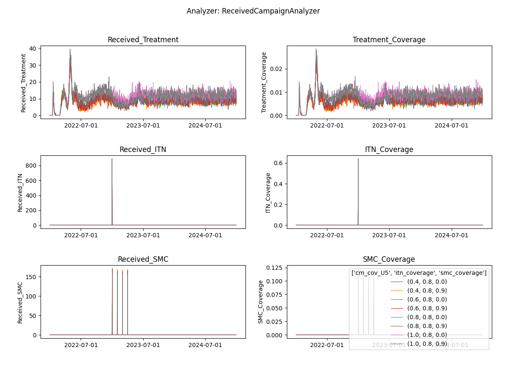

# Malaria Modeling Faculty Enrichment Program 2022

### Technical track (EMOD)

Example scripts for the [weekly lessons](https://faculty-enrich-2022.netlify.app/lessons/) of the faculty enrichment
program 2022.

**Prerequisites**: 
Before running the weekly example scripts, please ensure that EMOD and dtk have been successfully [installed]((https://faculty-enrich-2022.netlify.app/modules/install-emod/))
and that the [repository has been cloned](https://docs.github.com/en/repositories/creating-and-managing-repositories/cloning-a-repository)
to your local computer, ideally under _/<.username>/Documents/faculty-enrich-2022-examples_.
It also needs dtk virtual environment loaded and assumes files are run from a working directory set to where the script is located.


#### Weekly example exercises

- [Go to Week 1](#week1)    
- [Go to Week 2](#week2)    
- [Go to Week 3](#week3)    
- [Go to Week 4](#week4)    
- Week 5: no technical track
- [Go to Week 6](#week6)    _(TH)_
- [Go to Week 7](#week7)    _(BT)_
- [Go to Week 8](#week8)    _(MR)_
- [Go to Week 9](#week9)    _(JG&? )_
- Week 10: no technical track
- [Go to Week 11](#week11)    _(BT)_
- [Go to Week 12](#week12)    _(TH)_
- [Go to Week 13](#week13)    _(tbd)_
- [Go to Week 14](#week14)    _(BT)_

__Table 1: Overview of scripts used throughout the course__

|Script |Description | 
|-------|------------|
|analyzer_collection.py | collection of different analyzers used returning csv files| 
|analyzer_plots_collection.py | collection of different analyzers used returning plots instead of csv| 
|analyze_exampleSim_wX.py |the main analyzer script which changes each week (w1, w2,...w5) | 
|generate_input_files.py |the default script for creating demographics and climate which needs to run only once or when substantial changes are made | 
|plot_exampleSim.py, plot_exampleSim.R | plotting scripts outside of analyzerin python or R |
|run_exampleSim.py       |the main simulation script which will be expanded and modified throughout the lessons | 
|run_exampleBurnin_w6.py | first simulation script for week 6 where simulation is splitted into 2 runs (Burnin)  | 
|run_examplePickup_w6.py | second simulation script for week 6 where simulation is splitted into 2 runs (Pickup)   | 
|simtools.ini |  Configuration file for main directories required to run simulations (1 single file need in same directory where simulation or analyser script is run) | 

## Week 1: Overview of EMOD <a name="week1"></a>

[Lesson Week 1](https://faculty-enrich-2022.netlify.app/lessons/week-1/)

EMOD How To's:

- Update _simtools.ini_
- Define _exp_name_ and identify _expt_id_

### Instructions

<details><summary><span>Click to expand</span></summary>
<p>

- Adjust paths in `simtools.ini` by replacing `<USERNAME>` with your username in path (5 locations)
- Run simulation via `python run_exampleSim.py`
- Wait simulation to finish (~5 minutes)
    - Note, when running locally, the console might return an <span style="color:#ff6666">psutil.AccessDenied
      text</span>
      error, however the simulation can still successfully run and finish.
    - If there are problems with running locally, you can peek into [Week 6](#week6) on how to change `SetupParser` to
      run on _COMPS_ (requires login)!
- Go to the `experiments/` folder to notice the generated simulation experiment named '
  username_FE_2022_example_w1___2022_04_29_02_14_46_106520' The last part after the '___' is the experiment id and
  changes with each simulation.
- Update expt_id in `analyze_exampleSim_w1.py` Line 14 (copy number sequence after ___, also printed to console)
- Run analyzer via `python analyze_exampleSim_w1.py`
- Inspect `simulation_outputs/` to see generated simulation results (csv file and plot)
- Done!

<details><summary><span>Check results</span></summary>
<p>

Terminal output after running run_exampleSim.py


Once finished


Generated experiment files


Terminal output after running analyze_exampleSim_w1.py


Generated simulation output files


**All_Age_Monthly_Cases.csv** shows selected monitored malaria outcomes for the total population in the simulation
aggregated per month for the simulation duration, in this example 1 year.


Generated plot


</p>
</details>

</p>
</details>

## Week 2: Basic building blocks of EMOD <a name="week2"></a>

[Lesson Week 2](https://faculty-enrich-2022.netlify.app/lessons/week-2/)

EMOD How To's:

- [Update config parameters](https://faculty-enrich-2022.netlify.app/modules/emod-how-to/emod-how-to/#update-config-parameters)
- [Create a demographics file](https://faculty-enrich-2022.netlify.app/modules/emod-how-to/emod-how-to/#create-a-demographics-file)
- [Create climate files](https://faculty-enrich-2022.netlify.app/modules/emod-how-to/emod-how-to/#create-climate-files)
- [Add summary reports](https://faculty-enrich-2022.netlify.app/modules/emod-how-to/emod-how-to/#add-summary-reports) (
  annual)
- [Set up multi-simulation experiments](https://faculty-enrich-2022.netlify.app/modules/emod-how-to/emod-how-to/#using-the-model-builder-to-set-up-multi-simulation-experiments)


### Instructions

<details><summary><span>Click here to expand</span></summary>
<p>

- Create _demographics_ and _climate_ files via `python generate_input_files.py` _(requires access to COMPS for climate database : ask someone from NU team)_
- Update default parameters in `run_exampleSim.py`:

    ```py
    cb.update_params({
        'Demographics_Filenames': [os.path.join('Ghana', 'Ghana_2.5arcmin_demographics.json')],
        "Air_Temperature_Filename": os.path.join('Ghana', 'Ghana_30arcsec_air_temperature_daily.bin'),
        "Land_Temperature_Filename": os.path.join('Ghana', 'Ghana_30arcsec_air_temperature_daily.bin'),
        "Rainfall_Filename": os.path.join('Ghana', 'Ghana_30arcsec_rainfall_daily.bin'),
        "Relative_Humidity_Filename": os.path.join('Ghana', 'Ghana_30arcsec_relative_humidity_daily.bin'),
        "Age_Initialization_Distribution_Type": 'DISTRIBUTION_COMPLEX'
    })
    ```
- Add custom reporter with annual summary for different age groups (see EMOD How To's) or suggested example below. Add the import statement at the top and the call to `add_summary_report()` around line 26 (before `run_sim_args` is defined):
  ```py
  from malaria.reports.MalariaReport import add_summary_report
  add_summary_report(cb, start=1, interval=365,
                   age_bins=[0.25, 2, 5, 10, 15, 20, 100, 120], 
                   description='Annual_Agebin')
  ```
- Increase simulation duration from 1 to 3 years by modifying the initial call to DTKConfigBuilder:
  ```py 
  years = 3
  cb = DTKConfigBuilder.from_defaults('MALARIA_SIM', Simulation_Duration=years*365)
  ```
- Change _exp_name_  for week 2 `f'{user}_FE_2022_example_w2'`
- Run simulation as learned in week 1 and wait for simulation to finish (~5 minutes)
    - Note, if there are problems with running locally, you can peek into [Week 6](#week6) on how to
      change `SetupParser` to run on _COMPS_ (requires login)!
- Run analyzer script for Week 2 `analyze_exampleSim_w2.py` (don't forget to update expt_id!)
- Inspect `simulation_outputs` and the generated plots
    - Optional: rerun analyzer with plot for week 1 and compare.
    - _Note that EMOD is a stochastic model and any changes at low population size and few repetitions might be at
      random and not necessarily due to the parameter change!_
- Run additional simulations with different durations, population sizes or for different agebins _(Tip: change exp_name
  to keep track of your simulations)_
  ```py 
  # Example of how to change additional parameters from the config file
  cb.update_params({
        'x_Base_Population': 1,
        'x_Birth': 1,
        'x_Temporary_Larval_Habitat': 1
    })
  ```
- Again, inspect the simulation outputs and compare them against each other:
    - How do the outcomes change?
    - What do you recognize about running time?

<details><summary><span>Check results</span></summary>
<p>

Generated simulation files  


Generated plot from InsetChart  


Generated plot from annual summmary report  


View
suggested [solution script for week 2](https://github.com/numalariamodeling/faculty-enrich-2022-examples/blob/main/Solution_scripts/run_exampleSim_w2.py)

</p>
</details>

</p>
</details>

## Week 3: Interventions in EMOD <a name="week3"></a>

[Lesson Week 3](https://faculty-enrich-2022.netlify.app/lessons/week-3/)

EMOD How To's:

- [Case management](https://faculty-enrich-2022.netlify.app/modules/emod-how-to/emod-how-to/#add-case-management)
- Additional interventions
    - [ITN](https://faculty-enrich-2022.netlify.app/modules/emod-how-to/emod-how-to/#add-itn)
    - [IRS](https://faculty-enrich-2022.netlify.app/modules/emod-how-to/emod-how-to/#add-irs)
    - [Larvicides](https://faculty-enrich-2022.netlify.app/modules/emod-how-to/emod-how-to/#add-larvicides)
    - [Drug campaigns](https://faculty-enrich-2022.netlify.app/modules/emod-how-to/emod-how-to/#add-drug-campaigns)
    - [Vaccine](https://faculty-enrich-2022.netlify.app/modules/emod-how-to/emod-how-to/#add-vaccine)
- [Summary reports](https://faculty-enrich-2022.netlify.app/modules/emod-how-to/emod-how-to/#add-summary-reports) (
  monthly)
- [Event reporters](https://faculty-enrich-2022.netlify.app/modules/emod-how-to/emod-how-to/#event-reporting)
- [Set up multi-simulation experiments](https://faculty-enrich-2022.netlify.app/modules/emod-how-to/emod-how-to/#using-the-model-builder-to-set-up-multi-simulation-experiments)

### Instructions

#### PART I - customization of the simulation, add interventions and reports

<details><summary><span>Click here to expand</span></summary>
<p>

- Add case management + 2 additional interventions of choice to your simulation. For each intervention, add the
  corresponding code chunk as well as module import into the `run_exampleSim.py`.
    - Suggested intervention code snippets:
        - <details><summary><span style="color: blue";">add_health_seeking </span></summary>
            <p>

           ```py
            from malaria.interventions.health_seeking import add_health_seeking
            
            add_health_seeking(cb, start_day=366,
                               targets=[{'trigger': 'NewClinicalCase', 'coverage': 0.7,
                                         'agemin': 0, 'agemax': 5, 'seek': 1, 'rate': 0.3},
                                        {'trigger': 'NewClinicalCase', 'coverage': 0.5,
                                         'agemin': 5, 'agemax': 100, 'seek': 1, 'rate': 0.3},
                                        {'trigger': 'NewSevereCase', 'coverage': 0.85,
                                         'agemin': 0, 'agemax': 100, 'seek': 1, 'rate': 0.5}],
                               drug=['Artemether', 'Lumefantrine'])
            ```
             </p>
             </details>
        - <details><summary><span style="color: blue";">add_drug_campaign </span></summary>
            <p>

           ```py
            from malaria.interventions.malaria_drug_campaigns import add_drug_campaign
            
            add_drug_campaign(cb, campaign_type='SMC', drug_code='SPA',
                              coverage=0.8,
                              start_days=[366],
                              repetitions=4,
                              tsteps_btwn_repetitions=30,
                              target_group={'agemin': 0.25, 'agemax': 5},
                              receiving_drugs_event_name='Received_SMC')
           ```
             </p>
             </details>
        - <details><summary><span style="color: blue";">add_ITN </span></summary>
            <p>

           ```py                    
            from dtk.interventions.itn import add_ITN
            
            add_ITN(cb,
                    start=366,  # starts on first day of second year
                    coverage_by_ages=[
                        {"coverage": 1, "min": 0, "max": 10},  # Highest coverage for 0-10 years old
                        {"coverage": 0.75, "min": 10, "max": 50}, # 25% lower than for children for 10-50 years old
                        {"coverage":  0.6, "min": 50, "max": 125} # 40% lower than for children for everyone else
                    ],
                    repetitions=5,  # ITN will be distributed 5 times
                    tsteps_btwn_repetitions=365 * 3  # three years between ITN distributions
                    )
           ```
            </p>
            </details>
        - <details><summary><span style="color: blue";">add_IRS </span></summary>
            <p>

           ```py
            from dtk.interventions.irs import add_IRS
            
            add_IRS(cb, start=366,
                    coverage_by_ages=[{"coverage": 0.8, "min": 0, "max": 100}],
                    killing_config={
                        "class": "WaningEffectBoxExponential",
                        "Box_Duration": 180,  # based on PMI data from Burkina
                        "Decay_Time_Constant": 90,  # Sumishield from Benin
                        "Initial_Effect": 0.7},
                    )
           ```
            </p>
            </details>
        - <details><summary><span style="color: blue";">add_larvicides </span></summary>
            <p>

           ```py
            from dtk.interventions.novel_vector_control import add_larvicides
            
            add_larvicides(cb, start_day=366, 
                           habitat_target='CONSTANT',  
                           killing_initial=0.6,        
                           killing_decay=150          
                           )
           ```
            </p>
            </details>          
        - <details><summary><span style="color: blue";">add_vaccine </span></summary>
            <p>

           ```py
            from malaria.interventions.malaria_vaccine import add_vaccine
            
            add_vaccine(cb,
                        vaccine_type='RTSS',
                        vaccine_params={"Waning_Config":
                                            {"Initial_Effect": 0.8,
                                             "Decay_Time_Constant": 592.4066512,
                                             "class": 'WaningEffectExponential'}},
                        start_days=[366],
                        coverage=0.2,
                        repetitions=1,
                        tsteps_btwn_repetitions=-1,
                        target_group={'agemin': 274, 'agemax': 275})  # children 9 months of age
           ```
            </p>
            </details>
- To keep track of the campaign events in the simulations, add `event_list` and expand as needed
  via  `event_list = event_list + [<new_event_name>]`
    - Event
      names:  `'Received_Treatment', 'Received_Severe_Treatment','Received_ITN','Received_IRS', 'Received_SMC', 'Received_Vaccine' `
      For example, if you added case management and ITNs, define `event_list` like this:
        ``` py
      event_list = ['Received_Treatment', 'Received_ITN']
      ```
- Next, add an event reporter to monitor these events:
    - Report_Event_Recorder and Report_Event_Counter:
      ``` py
      from malaria.reports.MalariaReport import add_event_counter_report

      add_event_counter_report(cb, event_trigger_list=event_list, start=0, duration=10000)
      ```
- Change _exp_name_ for week 3 `f'{user}_FE_2022_example_w3a'`
- Now, run the simulation and wait for it to finish (~5 minutes)
- While simulations runs, look at the generated campaign file, does it include all interventions
  specified?
    - The `campaign.json` file is located in your experiment simulation folder.
- Run analyzer script for Week 3 (`analyze_exampleSim_w3a.py`) 
    - Don't forget to update _expt_id_!
    - And update `event_list` in the analyzer to what you used in `run_exampleSim.py`
- Inspect the different results generated in `simulation_outputs`.
    - Are all intervention events happening as expected?
    - Parameters changes you can explore with further simulations:
        - disable and enable interventions by changing coverage: be sure to change your experiment name if you run more experiments.
            - does malaria transmission get interrupted if you set all to 1?
        - age group receiving an intervention
        - efficacy or start date of an intervention
- __Extension__: run another simulation to try out other interventions
  - i.e. when using `add_ITN_age_season` instead of `add_ITN` it allows to track the custom events 
    `'Bednet_Got_New_One', 'Bednet_Using', 'Bednet_Discarded'`. 
    - <details><summary><span style="color: blue";">add_ITN_age_season </span></summary>  
        <p>

       ```py
        from dtk.interventions.itn_age_season import add_ITN_age_season
        add_ITN_age_season(cb, start=366,
                           demographic_coverage=0.8,
                           killing_config={
                               "Initial_Effect": 0.520249973,  # LLIN Burkina
                               "Decay_Time_Constant": 1460,
                               "class": "WaningEffectExponential"},
                           blocking_config={
                               "Initial_Effect": 0.53,
                               "Decay_Time_Constant": 730,
                               "class": "WaningEffectExponential"},
                           discard_times={"Expiration_Period_Distribution": "DUAL_EXPONENTIAL_DISTRIBUTION",
                                          "Expiration_Period_Proportion_1": 0.9,
                                          "Expiration_Period_Mean_1": 365 * 1.7,  # Burkina 1.7
                                          "Expiration_Period_Mean_2": 3650},
                           age_dependence={'Times': [0, 100],
                                           'Values': [0.9, 0.9]},
                           duration=-1, birth_triggered=False
                           )
       ```
        </p>
        </details>
    - When the simulation is complete, try running the BednetUsageAnalyzer.

- __Extension__: Try another analyzer such as the TransmissionReport.
- __Extension__: Try adding ReportEventRecorder (see how-to's) and use the IndividualEventsAnalyzer to look at output.


<details><summary><span>Check results</span></summary>
<p>

Raw output files in the experiment folder under outputs.


**ReportEventCounter** with campaign events, aggregated for total population. Most Interventions were set to start after
day 366, hence there are 365 zeros in the `"Data": [0, 0, ...]`  

  

_Tip: Notepad ++ offers helpful json plugins. Json files can also be viewed in Pycharm._

Generated results after running analyzer in simulation_outputs/<.exp_name>:  


Aggregated event report


View
suggested [solution script for week 3 (a)](https://github.com/numalariamodeling/faculty-enrich-2022-examples/blob/main/Solution_scripts/run_exampleSim_w3a.py)


</p>
</details>

</p>
</details>

#### PART II - multi-simulation experiment using ModBuilder

<details><summary><span>Click here to expand</span></summary>
<p>

- Add `ModBuilder` to allow running different parameter sweeps
    ```py
    from simtools.ModBuilder import ModBuilder, ModFn

    numseeds = 3
    builder = ModBuilder.from_list([[ModFn(case_management, cm_cov_U5),                     
                                     ## ModFn(xxx_intervention, coverage_level=xxx_cov),  # adjust to add other interventions
                                     ModFn(DTKConfigBuilder.set_param, 'Run_Number', x)
                                    ]
                                    for cm_cov_U5 in [0.4, 0.6] 
                                    ## for xxx_cov in [0, 0.6] 
                                    for x in range(numseeds)
                                    ])
    ```

    Adjust the `run_sim_args` block to include the builder:
    ```py
    run_sim_args = {
        'exp_name': f'{user}_FE_2022_example_w3',
        'config_builder': cb,
        'exp_builder' : builder
    }
    ```

- ModBuilder can consume the same `add_x()` functions we used above, but it's often cleaner to wrap each `add_x()` into another function. For each intervention you wrap and use in the builder, make sure that it's not ALSO called directly using `add_x()`.
    - <details><summary><span style="color: blue";">case_management </span></summary>
       <p>

       ```py
        def case_management(cb, cm_cov_U5, cm_cov_adults=0.5):
            add_health_seeking(cb, start_day=0,
                               targets=[{'trigger': 'NewClinicalCase', 'coverage': cm_cov_U5,
                                         'agemin': 0, 'agemax': 5, 'seek': 1, 'rate': 0.3},
                                        {'trigger': 'NewClinicalCase', 'coverage': cm_cov_adults,
                                         'agemin': 5, 'agemax': 100, 'seek': 1, 'rate': 0.3},
                                        {'trigger': 'NewSevereCase', 'coverage': 0.85,
                                         'agemin': 0, 'agemax': 100, 'seek': 1, 'rate': 0.5}],
                               drug=['Artemether', 'Lumefantrine'])
        
            return {'cm_cov_U5': cm_cov_U5,
                    'cm_cov_adults': cm_cov_adults}
        ```
         </p>
         </details>
    - <details><summary><span style="color: blue";">smc_intervention </span></summary>  
        <p>

       ```py
        def smc_intervention(cb, coverage_level, day=366, cycles=4):
            add_drug_campaign(cb, campaign_type='SMC', drug_code='SPA',
                              coverage=coverage_level,
                              start_days=[day],
                              repetitions=cycles,
                              tsteps_btwn_repetitions=30,
                              target_group={'agemin': 0.25, 'agemax': 5},
                              receiving_drugs_event_name='Received_SMC')
        
            return {'smc_start': day,
                    'smc_coverage': coverage_level}

       ```

         </p>
         </details>
    - <details><summary><span style="color: blue";">itn_intervention </span></summary>
        <p>

       ```py  
        def itn_intervention(cb, coverage_level, day=366):
            add_ITN(cb,
                    start=day,  # starts on first day of second year
                    coverage_by_ages=[
                        {"coverage": coverage_level, "min": 0, "max": 10},  # Highest coverage for 0-10 years old
                        {"coverage": coverage_level * 0.75, "min": 10, "max": 50},
                        # 25% lower than for children for 10-50 years old
                        {"coverage": coverage_level * 0.6, "min": 50, "max": 125}
                        # 40% lower than for children for everyone else
                    ],
                    repetitions=5,  # ITN will be distributed 5 times
                    tsteps_btwn_repetitions=365 * 3  # three years between ITN distributions
                    )
            return {'itn_start': day, 'itn_coverage': coverage_level}
      
      event_list = event_list + ['Received_ITN']

       ```
       ```py                    
        ### Or alternatiively 
        def itn_intervention(cb, coverage_level, day=366):
            add_ITN_age_season(cb, start=day,
                               demographic_coverage=coverage_level,
                               killing_config={
                                   "Initial_Effect": 0.520249973,  # LLIN Burkina
                                   "Decay_Time_Constant": 1460,
                                   "class": "WaningEffectExponential"},
                               blocking_config={
                                   "Initial_Effect": 0.53,
                                   "Decay_Time_Constant": 730,
                                   "class": "WaningEffectExponential"},
                               discard_times={"Expiration_Period_Distribution": "DUAL_EXPONENTIAL_DISTRIBUTION",
                                              "Expiration_Period_Proportion_1": 0.9,
                                              "Expiration_Period_Mean_1": 365 * 1.7,  # Burkina 1.7
                                              "Expiration_Period_Mean_2": 3650},
                               age_dependence={'Times': [0, 100],
                                               'Values': [0.9, 0.9]},
                               duration=-1, birth_triggered=False
                               )
    
            return {'itn_start': day,
                    'itn_coverage': coverage_level}
          
       event_list = event_list + ['Bednet_Got_New_One', 'Bednet_Using', 'Bednet_Discarded']  # when using add_ITN_age_season

       ```
        </p>
        </details>
    - <details><summary><span style="color: blue";">irs_intervention </span></summary>
        <p>

       ```py
        # IRS, start after 1 year - single campaign
        def irs_intervention(cb, coverage_level, day=366):
            add_IRS(cb, start=day,
                    coverage_by_ages=[{"coverage": coverage_level, "min": 0, "max": 100}],
                    killing_config={
                        "class": "WaningEffectBoxExponential",
                        "Box_Duration": 180,  # based on PMI data from Burkina
                        "Decay_Time_Constant": 90,  # Sumishield from Benin
                        "Initial_Effect": 0.7},
                    )
        
            return {'irs_start': day,
                    'irs_coverage': coverage_level}

       ```
        </p>
        </details>
    - <details><summary><span style="color: blue";">rtss_intervention </span></summary>  
        <p>

       ```py
        # malaria vaccine (RTS,S), no booster start after 1 year
        def rtss_intervention(cb, coverage_level, day=366, agemin=274, agemax=275, initial_efficacy=0.8):
            add_vaccine(cb,
                        vaccine_type='RTSS',
                        vaccine_params={"Waning_Config":
                                            {"Initial_Effect": initial_efficacy,
                                             "Decay_Time_Constant": 592.4066512,
                                             "class": 'WaningEffectExponential'}},
                        start_days=[day],
                        coverage=coverage_level,
                        repetitions=1,
                        tsteps_btwn_repetitions=-1,
                        target_group={'agemin': agemin, 'agemax': agemax})  # children 9 months of age
        
            return {'rtss_start': day,
                    'rtss_coverage': coverage_level,
                    'rtss_initial_effect': initial_efficacy}
       ```
        </p>
        </details>  

- change _exp_name_  to `f'{user}_FE_2022_example_w3b'` and the simulation is ready to go!
  
- Run simulations 
    - While waiting, check out the generated experiment folder, that now includes more subfolders for each of the
      single simulations. Open two campaign files and compare, do you see any differences?   
      _(Tip: Many text editors allow side by side comparison of two scripts, automatically highlighting differences)_

- Open second analyzer script for Week 3 (`analyze_exampleSim_w3b.py`) to update the _exp_id_ as usual, but now also check 
  that all the relevant sweep variables are included in _sweep_variables_ and all the events of interest are included in _event_list_. 
  The sweep_variables need to change according to the `ModBuilder` and custom functions that return parameters, which
  uniquely define single simulations.
  ```py
      ## Example of sweep_variables in analyzer (customize to your simulation)  
      sweep_variables = ['cm_cov_U5', 'smc_coverage', 'itn_coverage', 'irs_coverage', 'rtss_coverage', 'Run_Number']
  ```
- Inspect `simulation_outputs` and compare against outputs from the previous week.  
  
- Change intervention parameters in the `ModBuilder` and repeat the simulation process to become more familiar with the
  whole process.  

<details><summary><span>Check results</span></summary>
<p>

The generated result figures include separate lines. The `Run_Numbers` were aggregated using the mean and the intervention
coverage levels are used as additional grouping variables when aggregating simulation outputs. You may need to adjust the location of the legend if it's covering your plot!

Examples with 4 levels of case management and 2 levels (off and on) of SMC:

__Fig: Agebin_PfPR_ClinicalIncidence__


__Fig: All_Age_Monthly_Cases__


__Fig: Interventions distributed__



Note, if too many parameters changed at once without clear labelling, the results can become difficult to interpret!


View
suggested [solution script for week 3 (b)](https://github.com/numalariamodeling/faculty-enrich-2022-examples/blob/main/Solution_scripts/run_exampleSim_w3b.py)

</p>
</details>

</p>
</details>  

## Week 4: Analyzers and plotters <a name="week4"></a>

[Lesson Week 4](https://faculty-enrich-2022.netlify.app/lessons/week-4/)

EMOD How To's:

- [Add summary reports](https://faculty-enrich-2022.netlify.app/modules/emod-how-to/emod-how-to/#add-summary-reports)
- [Update config parameters](https://faculty-enrich-2022.netlify.app/modules/emod-how-to/emod-how-to/#update-config-parameters)
- [Analyze experiments](https://faculty-enrich-2022.netlify.app/modules/emod-how-to/emod-how-to/#analyze-experiments)

### Instructions

#### PART I - Analyzer

<details><summary><span>Click here to expand</span></summary>
<p>

- Cleanup your simulation script of any unwanted interventions that were explored during the previous week (keep a
  copy!)
    - Adjust coverage levels in `ModBuilder` to select/unselect interventions to include or change number of simulations
      to run (optional)
- Add an individual-level event reporter. This example assumes there is case management for malaria in the simulation.
  ```py
  cb.update_params({
    'Report_Event_Recorder': 1,  # Enable generation of ReportEventRecorder.csv  
    'Report_Event_Recorder_Ignore_Events_In_List': 0, # Logical indicating whether to include or exclude the events specified in the list 
    'Report_Event_Recorder_Events': ['NewClinicalCase', 'Received_Treatment'], # List of events to include
    })
    ```
- Add a new summary report with monthly monitoring for _children under the age of 5 years_ only (keep min age 0.25)
  ```py
  for year in range(years):
    start_day = 365 + 365 * year
    sim_year = sim_start_year + year
    add_summary_report(cb, start=start_day, interval=30,
                       age_bins=[0.25, 5, 100],
                       description=f'Monthly_U5_{sim_year}')
    ```  
- Add `MalariaFilteredReport` which is the same as `InsetChart` but we can ask only to report on part of the simulation time (or just a subset of nodes, for spatial simulations).
  ```py
  from malaria.reports.MalariaReport import add_filtered_report, add_event_counter_report
  add_filtered_report(cb, start=(years-1)*365, end=years * 365)
  ```
   - Any analyzer script in [analyzer_collection.py](https://github.com/numalariamodeling/faculty-enrich-2022-examples/blob/main/analyzer_collection.py)
      that uses `InsetChart.json` can use `ReportMalariaFiltered.json` instead if you update the `self.filenames=` section.

- Change _exp_name_ to `f'{user}_FE_2022_example_w4'` for week 4
- Run simulations
    - While simulations are running, you may take a look at `analyze_exampleSim_w4.py`, and corresponding `analyzer_collection.py` to
      explore the different Analyzer Classes used, no need to understand these in detail!
- Run the analyzer script `analyze_exampleSim_w4.py` (_remember to change exp_id :)_ )
    - This time, we didn't automatically generate plots! Now up to you to generate the plots you need.
- Inspect `simulation_outputs` and familiarize yourself with the csv files and match them to the analyzer + reports used in
  the simulation
- Run additional simulations and change the reports, for instance the agebins or reporting interval, and edit the
  analyzer accordingly (both `analyze_exampleSim_w4.py`, and corresponding `analyzer_collection.py`)!
    - __Change age group__:
        - Add summary report for children under the age of 10 (U10) in your simulation script.
        - In the analyzer script, copy the analyzer _MonthlyPfPRAnalyzerU5_ and replace U5 with U10
            - _voilà_  a new analyzer for malaria outcomes aggregated for children under the age of 10 has been created!
            - The principle of the MonthlyPfPRAnalyzers is the same for any age group as long as the indexing and number
              of agebins are matched correctly!  
              
    - __Change monitoring interval__:
        - Add summary report for weekly reporting in your simulation script.
        - Note: In practice a monitoring intervals of either 365 or 30 days are easiest to interpret and collected
          data is also often per months or year. But in some occassions and also for exercise, weekly agebins might
          be of interest too (for shorter total simulation period).  
          
    - __Analyze additional outcome measures__ to look at (no new simulation needed)
        - Look at the json file under `DataByTimeAndAgeBins` (in COMPS or Notepadd++)
            - additional outcome examples 'New Infections by Age Bin', 'Annual Moderate Anemia by Age Bin', 'Mean
              Log Parasite Density by Age Bin'
        - Add additional lines for new outcome measure, i.e. New Infections
              ```py 
                d = data[fname]['DataByTimeAndAgeBins']['New Infections by Age Bin'][:12]
                new_infect = [x[age] for x in d] 
              ```
              ```py 
              simdata = pd.DataFrame({'month': range(1, 13),
                                      'PfPR': pfpr,
                                      'Cases': clinical_cases,
                                      'Severe cases': severe_cases,
                                      'New infections': new_infect, ## newly added
                                      'Pop': pop})
              ``` 
- Great! All the changes done demonstrate the flexibility of analyzers that can be highly customized to the user's and project needs.
  If you are interested to learn more about `reporters` and how to analyze them, check out the EMOD How To's or IDM's EMOD documentation!
- __Optional__:
  - Advanced: check the analyzer_collection.py for other analyzers that might be applicable to your simulation.
    You also may have noticed that there are 2 analyzer commented out in `analyze_exampleSim_w4.py` , you can try to uncomment them to enable them and rerun the analyzer.
    _(Using comments is a convenient way to adjust which analyzers to run.)_
  - It time: play around with [json_explorer.py](https://github.com/numalariamodeling/faculty-enrich-2022-examples/blob/main/json_explorer.py) in Pycharm interactively to better understand reading in data from json selectively!  

<details><summary><span>Check results</span></summary>
<p>

Example of EMOD generated simulation outputs  


Example of a summary report json file, MalariaSummaryReport_Annual_Agebin.json  


Example of simulation results, after running the analyzer (only csv files, see Part II for plots). The csv files
that you should have:

- _'All_Age_InsetChart.csv'_ ,
- _'Agebin_PfPR_ClinicalIncidence_annual.csv'_ ,
- _'Event_Count.csv'_
- _'U5_PfPR_ClinicalIncidence.csv'_  ## or more depending on additional summary reports for aggregated age
- _'annual_transmission_report_all_years.csv'_   ## (optional)
- _'IndividualEvents_all_years.csv'_    ## (optional)


View suggested solution scripts for week
4 [simulation file](https://github.com/numalariamodeling/faculty-enrich-2022-examples/blob/main/Solution_scripts/run_exampleSim_w4.py)
,
and [edited analyzer file](https://github.com/numalariamodeling/faculty-enrich-2022-examples/blob/main/Solution_scripts/analyze_exampleSim_w4_edited.py)
.


</p>
</details>

</p>
</details>

#### PART II - Plotting

<details><summary><span>Click here to expand</span></summary>
<p>

- Check your csv files (see Part I) and make sure all required csv files were generated, optionally disable plots in the plotting script
  by commenting them out.
- Run plotting scripts either using Python or R:
    - _Python_: `plot_exampleSim_w4.py`
    - _R_: `plot_exampleSim_w4.R`
- Look at the figures more critically, anything you would like to change?
    - Given the interventions implemented does the curves look as expected?
- Open the plotting script of your choice (python or R) and adjust axis titles, colors or even add your own plot!
    - Note that the plots simply combine all sweep_variables in the legend. When having too many sweeps, the final output becomes difficult to interpret. 
      These plots are good for diagnostic checks of correctness of experiment simulated, but not for presenting to others.
- Some suggested explorations _(no need to do all, some more meaningful than others ;)
  - __plot_inset_chart__: per default plots selected channels over time per sweep_variables combination
    - a) modify `channels_inset_chart` to plot other channels (might need to adjust analyzer to write out more channels)
    - b) modify x axis to show date in different format and interval
    - c) change color for no intervention (case management only) to black.
    - d) add custom labels to sweep_variable combinations to have a better readable legend  
  - __plot_summary_report__:
    - a) apply some of the changes done for __plot_inset_chart__ to the summary report
    - b) when you have added an additional age group analyzer, modify `Uage` to plot results for the other age group
  - __plot_agebin_summary_report__: per default aggregates all years to plot agebins on the x-axis, and has
    multiple panels of defined channels (`channels_summary_report`).
    - a) modify the figure to have agebin as color and unique_scen as panels, with time on the x-axis (annual or
      monthly summary report csv)
    - b) modify the figure to have agebin as panels (facets) and time on the x-axis (annual or monthly summary
      report csv) 
  - __plot_events__:
   - a) adjust y-axis to for coverage channels to show values as percentage
   - b) set y-axis limits to have same y-axis for the left panels (number of individuals that received an intervention) 
     and for the right panels  (proportion of individuals that received an intervention) 
    
<details><summary><span>Check results</span></summary>
<p>

Example Agebin_PfPR_ClinicalIncidence figure generated in Python  


Example Agebin_PfPR_ClinicalIncidence figure generated in R  


Example All_Age_Monthly_Cases figure generated in Python  


Example All_Age_Monthly_Cases figure generated in R  


<!--
Example Transmission_Monthly figure generated in Python  


Example All_Age_Monthly_Cases figure generated in R  

-->

Example Events figure generated in Python  
  

Example Events figure generated in R
  

</p>
</details>

</p>
</details>

### Week 5: no technical curriculum <a name="week5"></a>

## Week 6: Serialization <a name="week6"></a>

[Lesson Week 6](https://faculty-enrich-2022.netlify.app/lessons/week-6/)

EMOD How To's:

- [Serialization](https://faculty-enrich-2022.netlify.app/modules/emod-how-to/emod-how-to/#serialization)

### Instructions

**Part 1: Set-Up Serialization & Run Burn-in**

<details><summary><span>Click here to expand</span></summary>
<p>

- Change the value of `SetupParser.default_block` from 'LOCAL' to **'HPC'**
    - This is to run the longer simulation on COMPS, as opposed to your local machine
- Add a variable 'serialize_year' to the run_exampleSim.py script (without any interventions), and set it equal to 50.
- Update the configuration parameters as shown below to enable serialization
- Run simulation
- Copy the experimentID ('expID') from the simulation metadata to pick-up from later.

</p></details>


**Part 2: Pick-up & run simulations from burn-in**

<details><summary><span>Click here to expand</span></summary>
<p>

- Add a variable 'pull_year' and set it equal to 50
- Add a variable 'burnin_id' and set it equal to the experimentID copied from Part 1.
- Update configuration parameters to pick-up from the end of your burn-in simulation
- Import retreive_experiment from dtk-tools
- Use retreive_experiment to load the burn-in and group by tags
- Pick-up the simulations and run for 2 years with some intervention, and at least 10 random seeds

<details><summary><span>Check results</span></summary>
<p>

[To do: add image]
<!---->

</p>
</details>

</p>
</details>

## Week 7: Sweeping and calibration <a name="week7"></a>

[Lesson Week 7](https://faculty-enrich-2022.netlify.app/lessons/week-7/)

EMOD How To's:

- Sweeping and calibration
- [TODO]

### Instructions

<details><summary><span>Click here to expand</span></summary>
<p>

- Modify `run_exampleBurnin_w6.py` script with the following (You should duplicate and change the file name!)
  + Change `serialize_years` to 20
  + Use `ModBuilder` to run 5 simulations instead of 1
  + ```
    numseeds = 5
    builder = ModBuilder.from_list([[ModFn(DTKConfigBuilder.set_param, 'Run_Number', x)]
                                    for x in range(numseeds)])
    ```
  + Add the `ModBuilder` object into `run_sim_args`
  + Modify `exp_name` in the `run_sim_args` to `f'{user}_FE_2022_example_w7a'`

- Run the burnin in COMPS
- Modify `burnin_id` in `run_examplePickup_w7.py`, understand what is the script trying to achieve here.
- Run the 'pickup' in COMPS
- Modify `expt_id` in `analyze_exampleSim_w7.py`
- Run the analyzer
- Finally run the script `select_w7.py`. This script calculate the average log-likelihood of each `itn_coverage` based on simulation output and produces some plots to visualize the parameter selection.
- Inspect the plot in the corresponding folder in `simulation_output` folder.
- (*Optional*) The choice of the `itn_coverage` here is based on 5 realizations which some may argue that the sample size is too small. Try to redo the exercise by increasing the number of realizations. 
  Note that you need to decide if you want to rerun the burnin, or just increase the number of realizations in the pickup phase instead (What are the pros and cons of the two approaches?)

<details><summary><span>Check results</span></summary>
<p>

The log-likelihood of the `itn_coverage` would be printed out and look like this:
```commandline
   itn_coverage        ll
0          0.20 -3.719067
1          0.25 -3.472211
2          0.30 -3.509376
3          0.35 -3.098715
4          0.40 -2.643516
5          0.45 -2.683272
6          0.50 -2.561883
```

And here is the plot out of `select_w7.py` script.
On the left is the observed data (size of bubble is proportionate to sample size) vs simulated mean PfPR trajectory. 
On the right is the `itn_coverage` values and their corresponding log-likelihood.


</p>
</details>

</p>
</details>

## Week 8: Individual properties

[Lesson Week 8](https://faculty-enrich-2022.netlify.app/lessons/week-8/)

EMOD How To's:

- Individual properties
- [TODO]

### Instructions

<details><summary><span>Click here to expand</span></summary>
<p>

- [TODO]

<details><summary><span>Check results</span></summary>
<p>

[To do: add image]
<!---->

</p>
</details>

</p>
</details>

## Week 9: Infusing simulations with real data <a name="week9"></a>

[Lesson Week 9](https://faculty-enrich-2022.netlify.app/lessons/week-9/)

EMOD How To's:

- [TODO]

### Instructions

<details><summary><span>Click here to expand</span></summary>
<p>

- [TODO]

<details><summary><span>Check results</span></summary>
<p>

[To do: add image]
<!---->

</p>
</details>

</p>
</details>

### Week 10: no technical curriculum <a name="week10"></a>

## Week 11: Advanced EMOD: HBHI workflow as a complex example <a name="week11"></a>

[Lesson Week 11](https://faculty-enrich-2022.netlify.app/lessons/week-11/)

EMOD How To's:

- [TODO]

### Instructions

<details><summary><span>Click here to expand</span></summary>
<p>

- [TODO]

<details><summary><span>Check results</span></summary>
<p>

[To do: add image]
<!---->

</p>
</details>

</p>
</details>

## Week 12: Advanced EMOD: Spatial modeling in EMOD <a name="week12"></a>

[Lesson Week 12](https://faculty-enrich-2022.netlify.app/lessons/week-12/)

EMOD How To's:

- [TODO]

### Instructions

<details><summary><span>Click here to expand</span></summary>
<p>

- [TODO]

<details><summary><span>Check results</span></summary>
<p>

[To do: add image]
<!---->

</p>
</details>

</p>
</details>

## Week 13: Advanced EMOD: gene drive and reactive interventions <a name="week13"></a>

[Lesson Week 13](https://faculty-enrich-2022.netlify.app/lessons/week-13/)

EMOD How To's:

- [TODO]

### Instructions

<details><summary><span>Click here to expand</span></summary>
<p>

- [TODO]

<details><summary><span>Check results</span></summary>
<p>

[To do: add image]
<!---->

</p>
</details>

</p>
</details>

## Week 14: HPC <a name="week14"></a>

[Lesson Week 14](https://faculty-enrich-2022.netlify.app/lessons/week-14/)

EMOD How To's:

- [TODO]

### Instructions

<details><summary><span>Click here to expand</span></summary>
<p>

- [TODO]

<details><summary><span>Check results</span></summary>
<p>

[To do: add image]
<!---->

</p>
</details>

</p>
</details>


</br>
</br>

### Congratulations!

#### You reached the end of the example lessons.


