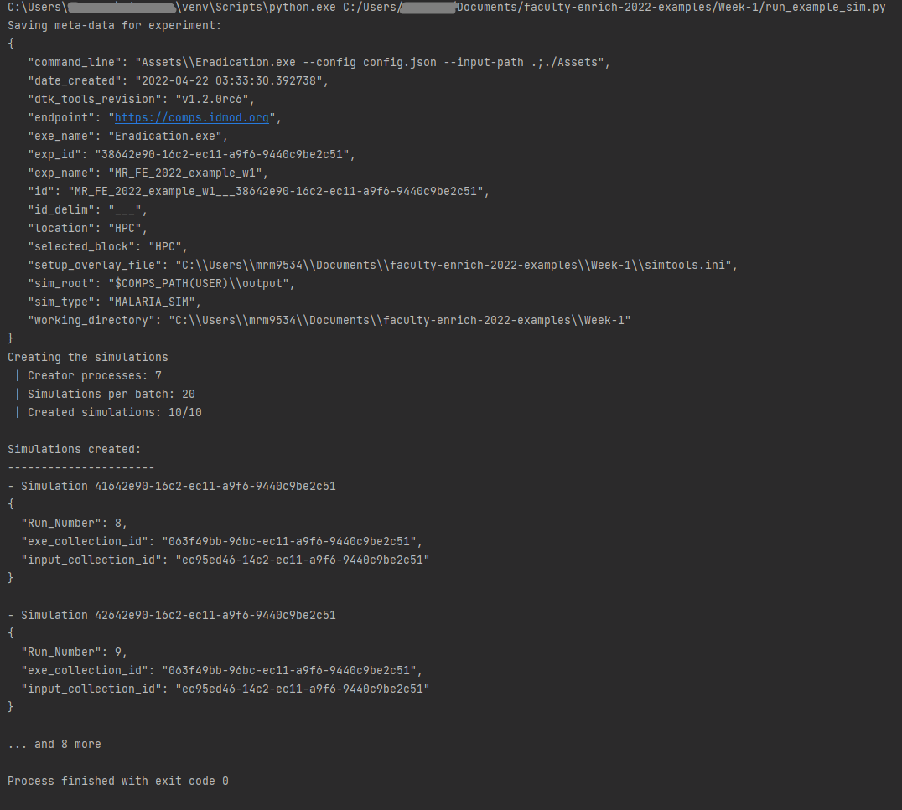
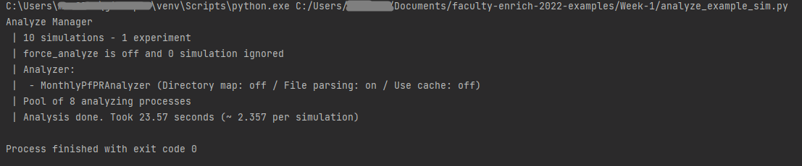

### Example code for Week 1

[Lesson Week 1](https://faculty-enrich-2022.netlify.app/lessons/week-1/)

#### Instructions:

- Save copy of `simtools.ini` to Week-1 directory and adjust paths `<USERNAME>` with your username  
- Navigate to `Week-1` via `cd` to make this working directory
- Run simulation via `python run_example_sim.py`
- Wait simulation to finish (~20 minutes)
- Update expt_id in `analyze_example_sim.py`
- Run analyzer via `python analyze_example_sim.py`
- Inspect `simulation_outputs` to see generated simulation results
- Done!

Terminal output after successful submission of experiment

Terminal output after successful submission of analyzer

