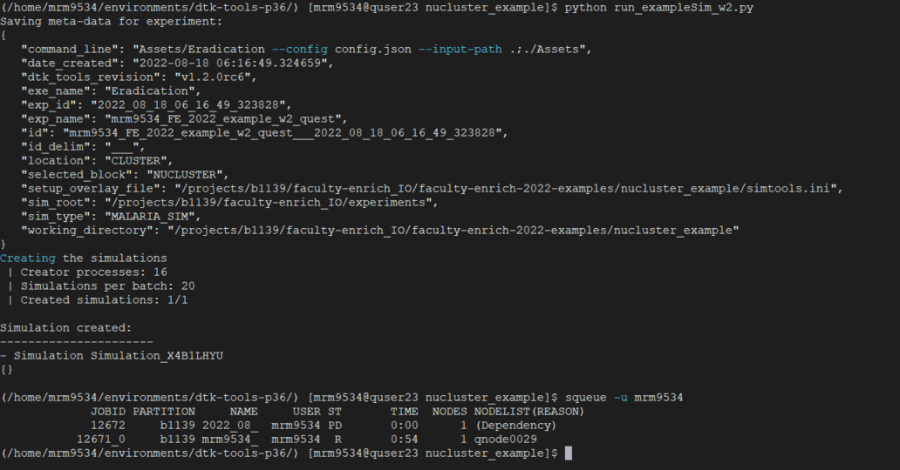
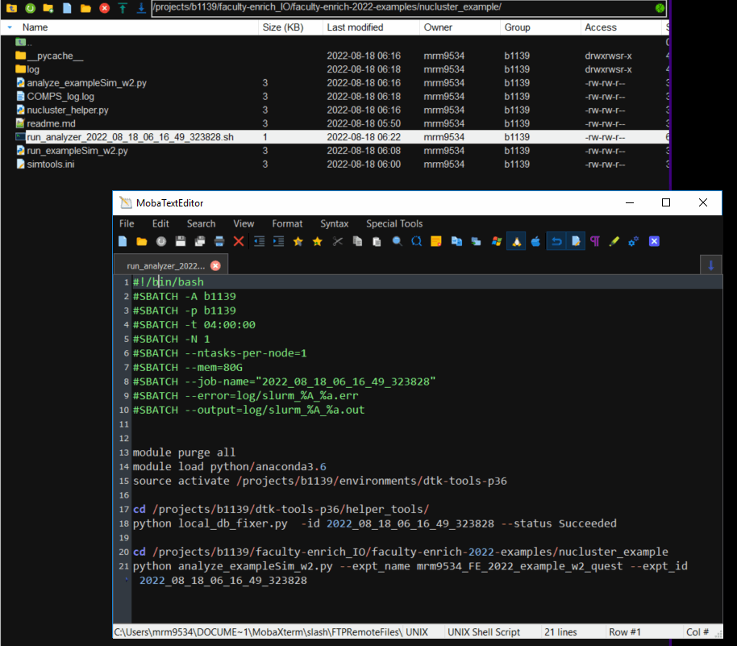
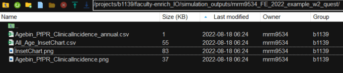

## Running EMOD experiments on Northwestern's cluster 'Quest' 

### Prerequisites:
- request and get access to Quest
- read the [Quest Quick Start Guide](https://kb.northwestern.edu/page.php?id=70706)
- install software to connect to Quest (i.e. [MobaXterm](https://mobaxterm.mobatek.net/) (recommended), or [FastX](https://www.starnet.com/fastx/))
- setup connections to file system and remote host (see start guide)
- clone your project repository to your home directory on quest
- ensure access to pre-existing dtk environment (`source activate /projects/b1139/environments/dtk-tools-p36`)
- setup your bashrc file to automatically load dependencies, such as dtk virtual environment 
- edit your simtools to run on Quest, see EMOD & Quest [4. Configuring DTK-Tools to use slurm](https://faculty-enrich-2022.netlify.app/resources/) 

### Recommendations 
- create a cheatsheet for yourself to quickly retrieve commonly used commands (can be simple txt file!)
- use relative paths and use an 'load_path' script in python or R to define directories
- enable argument parsing to run scripts from terminal without need to edit them each time (`import argparse`)
- use slurm job submissions to run experiments and analyzer on cluster
- _advanced_: build pipelines to run step1, step2,... etc, this requires error-free and robust scripts to avoid frustration
- _advanced_: enable SSH connection to GitHub, to avoid having to re-enter the password each time you push or pull.

_Please visit the [website](https://faculty-enrich-2022.netlify.app/resources/) for further resources and weblinks on using Quest and command lines._

### Example experiment to run
This simple exercise will run the example experiment from Week 2 on Quest.
The scripts have minimally been modified to accommodate flexible location of running them. 
In other words, enabling them to run on COMPS or on NUCLUSTER without needing to change the `SetupParser` or directories each time.

#### Basic steps:
*From your home directory on Quest*
1. Clone repository under your home directory on quest `/home/<USERNAME>/`
2. Modify simtools.ini and replace `<USERNAME>` and  `<your@email.edu>` under the section for `[NUCLUSTER]`!
3. Navigate to repository directory via `cd faculty-enrich-2022-examples/nucluster_example`
---------
*From existing repository under `/projects/b1139/`*  
3. Navigate to repository directory via `cd /projects/b1139/faculty-enrich_IO/faculty-enrich-2022-examples/nucluster_example/`

---------
4. Submit your experiment via `python run_exampleSim_w2.py` _(later on this command can also be submitted as a job via sh)_
5. Monitor terminal for any error messages
6. Type `squeue -u <username>` to check whether the experiment simulations are running on the cluster
   - if you realize you made an error, type `scancel <jobid>` to cancel the job (you are using shared resources)
   - and if desired, delete the experiment via `rm -r <full_path_to_experiment>`, **CAREFUL**: make sure you have the correct and complete path, to not delete anything else!
   - rerun step 3+4 to create and run a new experiment
7. Wait for simulation to finish 
8. Check simulation_outputs folder and error.log in the log folder for success of simulation and output files
9. In case the analyzer did not run, or outputs were not created, rerun the commands separately (look inside the `run_analyzer_<exp_id>.sh` ) in the terminal to check for errors, or apply other troubleshooting steps
10. Done!

Check results

Terminal output  

Generated analyzer submission script  

Simulation outputs  

